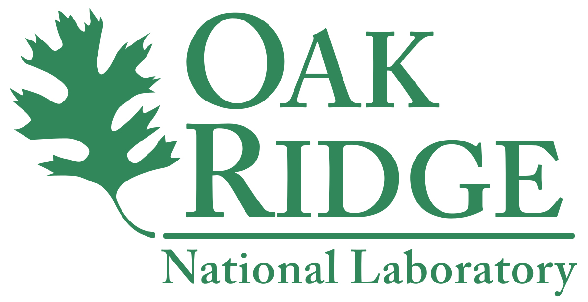
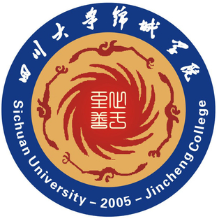

## 👩‍💻 About Me

Hi~ 👋 I'm **Xi Xiao (肖熙)**!  
I'm a 🎓 **second-year Ph.D. student** in the Department of Computer Science at **University of Alabama at Birmingham (UAB)**.  

I'm fortunate to be co-supervised by:  
🧠 [**Dr. Min Xu**](https://xulabs.github.io/min-xu/) (Carnegie Mellon University)  
🧑‍🏫 [**Dr. Tianyang Wang**](https://scholar.google.com/citations?user=QbTV0r0AAAAJ&hl=en) (UAB)  
🤖 [**Dr. Xingjian Li**](https://scholar.google.com/citations?user=f9V0NZkAAAAJ&hl=en) (CMU)

Currently, I'm a Graduate Student Researcher at 🧪 **Oak Ridge National Laboratory (ORNL)**,  
working with [**Dr. Xiao Wang**](https://www.ornl.gov/staff-profile/xiao-wang) and [**Dr. Isaac R Lyngaas**](https://www.ornl.gov/staff-profile/isaac-r-lyngaas).

## Research Interests

My research interests include Computer Vision and Natural Language Processing, currently focusing on Large Vision Models (LVMs) and innovative applications of Multimodal Large Language Models (MLLMs).

## News

- **[Feb. 2025]** 🌟 I will be joining the Computational Sciences and Engineering Division at <strong> Oak Ridge National Laboratory (ORNL)</strong> as a student researcher in the summer of 2025.
- **[Jan. 2025]** 🎉 Our work is accepted by Nature Scientific Reports!
- **[Dec. 2024]** I became a reviewer for IJCNN 2025!
- **[Dec. 2024]** 🎉 Our work(first-authored) is accepted by ICASSP 2025!
- **[Sept. 2024]** 🎉 Our work(first-authored) is accepted by ICTAI 2024!
- **[Aug. 2024]** 🎉 Our work(first-authored) is accepted by ICONIP 2024!
- **[Jul. 2024]** I became a reviewer for ICONIP 2024!
- **[Jul. 2024]** I became a reviewer for Women in Computer Vision Workshop at ECCV 2024!
- **[Mar. 2024]** I became a reviewer for IEEE TCSVT!
- **[Jan. 2024]** 🌟 Embarking on an exciting new journey! I officially started my Ph.D. studies at the University of Alabama at Birmingham.



## Experience

  
  

    <h4>Oak Ridge National Laboratory</h4>
    
<strong>2025.05 ~ present</strong>

    
Location: Oak Ridge, TN, USA

    
Role: Research Intern

    
Supervisor: <a href="https://www.ornl.gov/staff-profile/xiao-wang" target="_blank">Dr. Xiao Wang</a> and <a href="https://www.ornl.gov/staff-profile/isaac-r-lyngaas" target="_blank">Dr. Isaac R Lyngaas</a> 

  

  
  

    <h4>University of Alabama at Birmingham</h4>
    
<strong>2024.01 ~ present</strong>

    
Location: Birmingham, AL, USA

    
Degree: Ph.D. in Computer Science

    
Supervisor: <a href="https://xulabs.github.io/min-xu/">Dr. Min Xu</a> and <a href="https://scholar.google.com/citations?hl=en&user=QbTV0r0AAAAJ&view_op=list_works&sortby=pubdate" target="_blank">Dr. Tianyang Wang</a> 

  

  
  

    <h4>Sichuan University Jincheng College</h4>
    
<strong>2019.09 ~ 2023.06</strong>

    
Location: Chengdu, Sichuan, China

    
Degree: B.Eng. in Artificial Intelligence

    

  Supervisor: 
  <a href="https://www.nae.edu/27926/Dr-Steve-S-Chen" target="_blank">Dr. Steve Chen</a> 
  and 
  <a href="https://scholar.google.com/citations?hl=en&user=wGzmb8oAAAAJ&view_op=list_works&sortby=pubdate" target="_blank">Dr. Zhengji Li</a>

  



## Global Visitors Map

